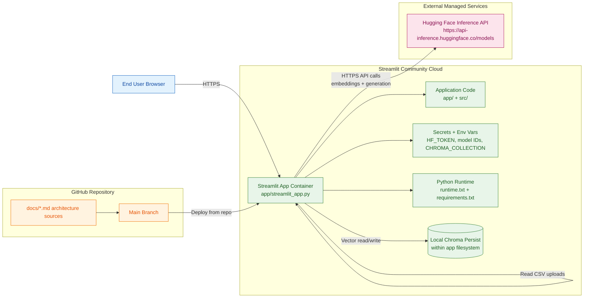

# Deployment Architecture (Detailed)

This document is the source-of-truth Markdown for rebuilding the deployment architecture diagram.

## Mermaid Diagram

## Deployment Notes

- No local model host, tunnel, or ngrok is needed.
- Inference dependency is externalized to Hugging Face.
- Streamlit secrets are the only required runtime credentials/config layer.
- This deployment is optimized for a single, deterministic provider path.
