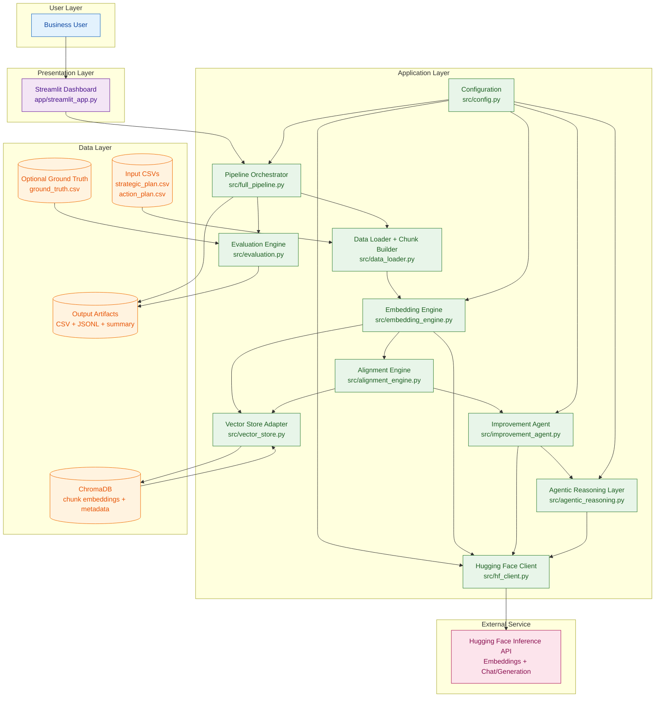

# System Architecture (Detailed)

This document is the source-of-truth Markdown for rebuilding the system architecture diagram.

## Mermaid Diagram

## Diagram Notes

- Single-provider architecture: Hugging Face only.
- `src/hf_client.py` is the single model gateway for embedding and generation calls.
- ChromaDB stores chunk-level vectors and metadata for retrieval/matching.
- Agentic and improvement stages operate only on low-alignment pairs.
- Evaluation runs when optional ground-truth mapping is provided.
